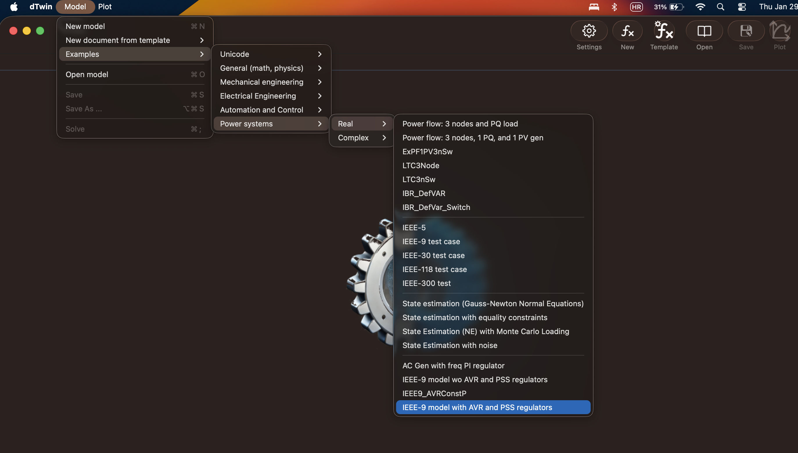
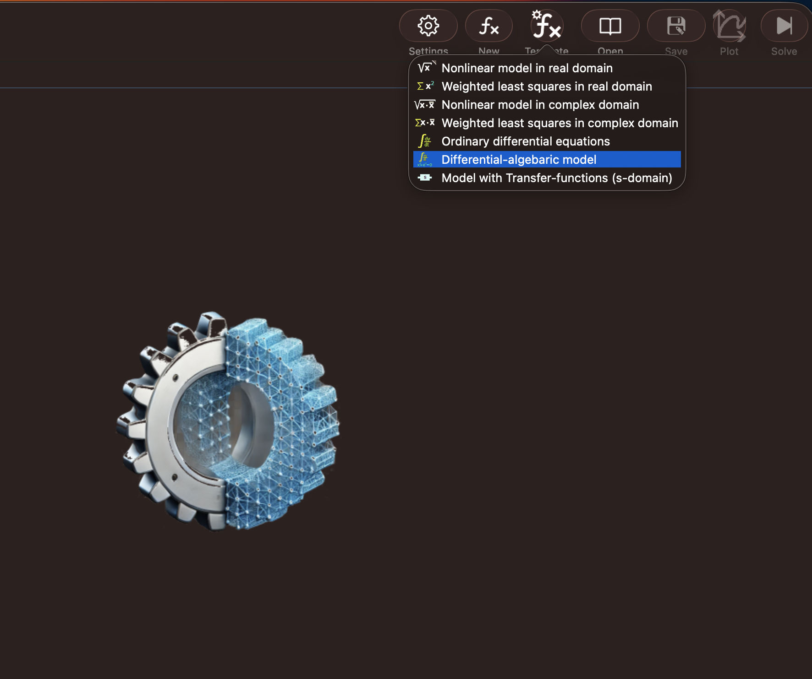
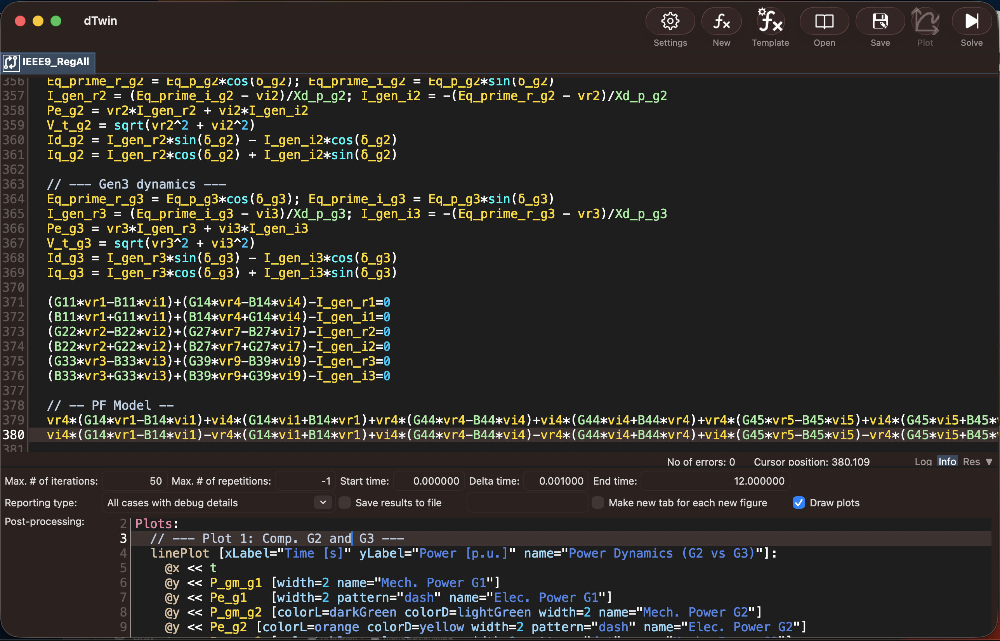
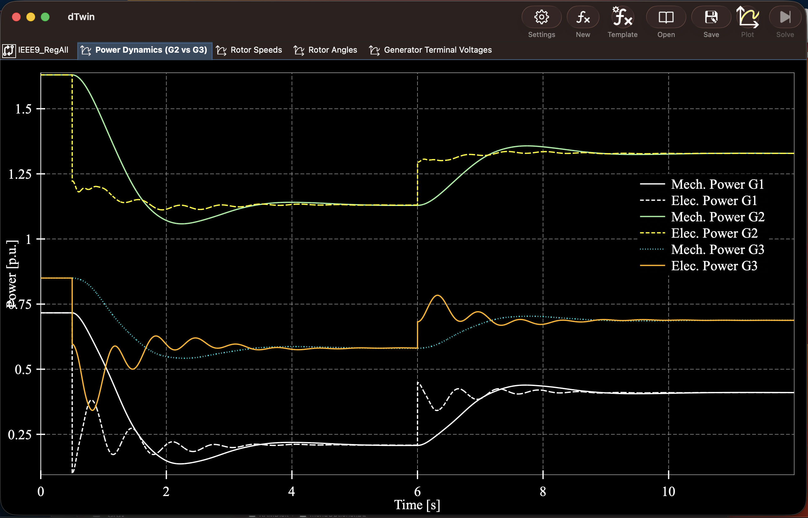
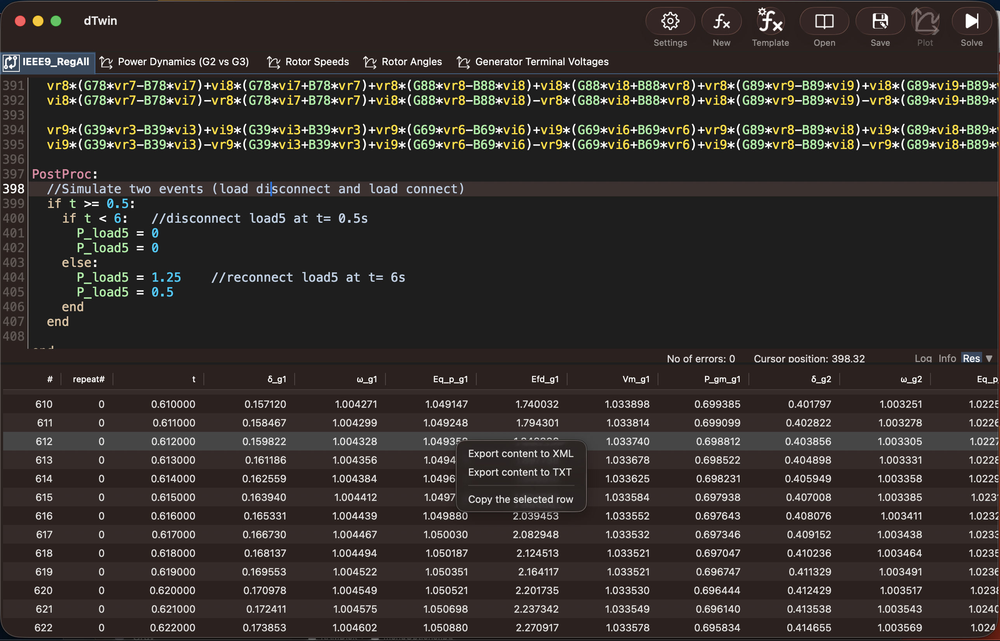

# dTWin Framework

**dTWin** is a cross-platform digital twin framework designed for modeling, simulation, and large-scale deployment of static and dynamic systems.  
It provides a unified ecosystem for building, testing, executing, and visualizing digital twins in **C++**, **Python**, and distributed environments.

The framework is modular by design and can be used both for desktop-based development and large-scale deployment scenarios.

---

## Key Features

- Cross-platform support: **macOS (Intel & Apple Silicon), Linux, Windows**
- Native **C++** performance with optional **Python** integration
- Desktop application for interactive modeling and simulation
- Extensible digital twin interfaces
- Scalable deployment via lightweight HTTP & WebSocket server
- Supporting tools for development and visualization

---

## Framework Modules

### 1. dTWin Desktop Application

A native desktop application for creating and working with digital twin models.

**Capabilities:**
- Enter and edit static and dynamic models
- Test and execute simulations
- Visualize results using interactive plots and graphs
- Run models locally with native performance

**Implementation:**
- Written in **C++**
- Runs natively on:
  - macOS (Intel & Apple Silicon)
  - Linux
  - Windows

This application serves as the primary interactive environment for digital twin development and experimentation.

**Screenshots:**












---

### 2. C++ Digital Twin Libraries

A set of **C++ dynamic libraries** providing a common `IModel` interface for digital twin development.

**Purpose:**
- Develop high-performance digital twins in C++
- Define static and dynamic models using a unified interface
- Integrate seamlessly with the dTWin desktop application and server

**Use cases:**
- Real-time simulations
- Embedded or performance-critical systems
- Integration into existing C++ codebases

---

### 3. Python dTwin Package with modelSolver module

A Python package for developing and executing digital twins using Python.

**Features:**
- Pythonic interface for defining digital twin models
- Ideal for rapid prototyping and experimentation
- Suitable for data-driven and hybrid modeling approaches
- Can be combined with existing scientific Python ecosystems

This module enables fast development while still integrating with the broader dTWin framework.

**Installation:**
- From official Python repository. 
- Works with Python 3.9 to 3.13
- Simply type in terminal:
```bash
pip install dTwin
```

**Details:**
For more details on dTwin see [dTwin.modelSolver readme.](README_modelSolver.md).

**Examples:**
- [Static and dynamic tests](examples/modelSolverTest.py).
- [IEEE-9 dynamics](examples/ieee9.py).

---

### 4. Tiny C++ HTTP & WebSocket Server

A lightweight **C++ HTTP server with WebSocket support** designed for scalable digital twin deployment.

**Capabilities:**
- Host and execute digital twin models remotely
- Real-time communication via WebSockets
- Suitable for large-scale or distributed deployments
- Minimal footprint and high performance

**Use cases:**
- Cloud-based digital twin services
- Industrial monitoring and control systems
- Distributed simulation environments

---

## Additional Tools & Utilities

Alongside the core modules, dTWin includes several supporting tools:

- **Visual Studio Code extension**  
  For editing and working with digital twin models directly in VS Code.

- **Python plotting scripts**  
  Lightweight utilities for post-processing and visualizing simulation results.

These tools improve developer productivity and streamline the modeling workflow.

---

## Typical Workflow

1. Develop and test models using the **dTWin Desktop Application**
2. Implement performance-critical models using **C++ libraries**
3. Prototype or extend models using **Python dTwinSolver**
4. Deploy models at scale using the **C++ HTTP/WebSocket server**
5. Visualize and analyze results using provided plotting tools

---

## Philosophy

dTWin is built around:
- **Modularity** – use only the components you need
- **Performance** – native C++ where it matters
- **Flexibility** – Python for rapid development
- **Scalability** – from desktop experiments to large deployments

---

## Contributing

Contributions, bug reports, and feature requests are welcome.  
Please open an issue or submit a pull request.

---

## Contact

[Project contact or homepage, if applicable]

Happy twinning 🚀

