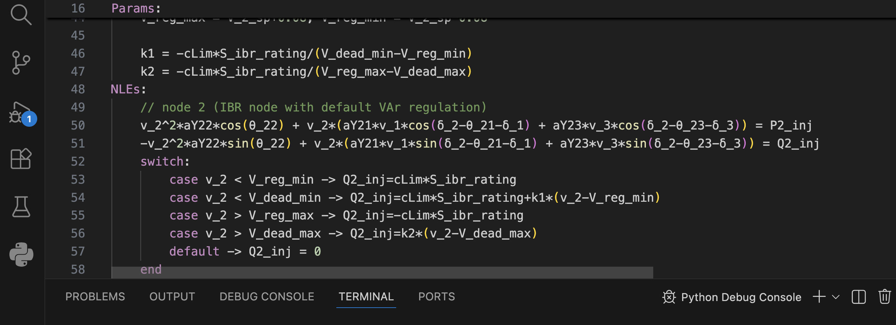

# Visual Studio Code Extension for dTwin Models

- Install this extension in VS Code (Install extension from file).
- Provides coloring of keywords and functions used in dTwin models

**VS Code Screenshot with dmodl extension:**

---

---

